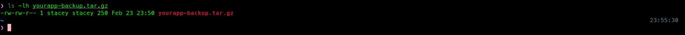
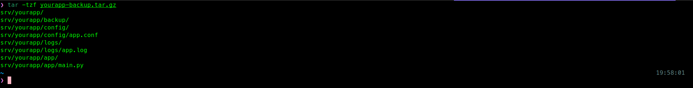
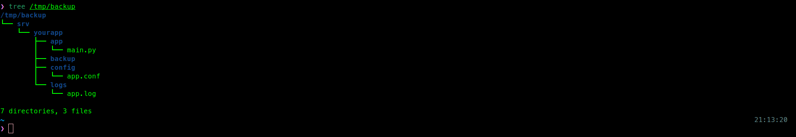
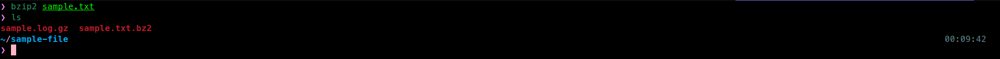

# Archive & Backup Directories

## Objectives 
Create, extract, and verify compressed archives in Linux 
using tar, gzip, and bzip2 to perform directory backups on a Linux system.

## Scenario
The `/srv/myapp/` directory needs to be archived before 
performing a system migration. The archive must be compressed 
to save storage space, and its contents should be verified 
before transferring it to another location.

### Step 1. Create a Compressed Archive
`tar` bundles multiple files and directories into a single archive, 
and compression reduces its size for faster transfer and storage.

#### Command
```zsh
tar -czf <ARCHIVE_NAME>.tar.gz <SOURCE_DIRECTORY>
```
#### Practice
```zsh
tar -czf yourapp-backup.tar.gz /srv/yourapp/
```
#### Result



### Step 2. Verify Archive Contents Without Extracting
Inspect the archive to confirm its contents.

#### Command 
```zsh
tar -tzf <ARCHIVE_NAME>.tar.gz
```
#### Practice
```zsh
tar -tzf yourapp-backup.tar.gz
```
#### Expected Output
Each line shows a file or directory path stored in the archive.
The output should match the structure of `/srv/yourapp/`.

#### Result 



### Step 3. Extract an Archive
Extract the archive to a specific destination to restore files
or inspect the backup in an isolated location.

#### Command
```zsh
tar -xzf <ARCHIVE_NAME>.tar.gz -C <DESTINATION_DIRECTORY>
```
#### Practice
```zsh
tar -xzf yourapp-backup.tar.gz -C /tmp/backup
```
#### Verify
```zsh
tree /tmp/backup
```
#### Result



### Step 4. Compress Files Using gzip
`gzip` compresses individual files and replaces the original file with a .gz version.

#### Command
```zsh
gzip <FILENAME>
```
#### Practice
```zsh
gzip sample.log
```
#### Expected Output
The original file is replaced `with sample.log.gz`.

#### Result


### Step 5. Compress Files Using bzip2
`bzip2` provides stronger compression than gzip but is generally slower.

#### Command
```zsh
bzip2 <FILENAME>
```
#### Practice
```zsh
bzip2 sample.txt
```
#### Expected Output
The original file is replaced with `sample.txt.bz2`.

#### Result


