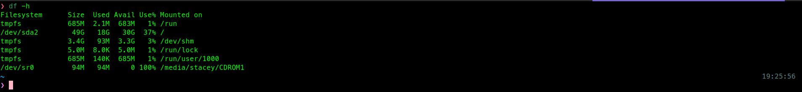
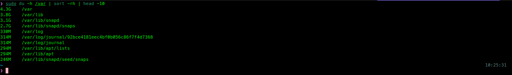

# Find & Analyze Large Files

## Objective
Locate and analyze large files and directories on a Linux system
using command-line tools to identify disk usage bottlenecks.

## Scenario
The server disk usage is increasing unexpectedly. I need to identify 
which files and directories consume the most space to prevent the 
disk from reaching full capacity.

### Step 1. Check Overall Disk Usage
Before examining specific directories, obtain a high-level 
overview of used and available disk space across all mounted filesystems.

#### Command
```zsh
df -h
```
#### Practice
```zsh
df -h
```
#### Result



### Step 2. Analyze Disk Usage Per Directory
`df` displays disk usage at the filesystem level, while `du` provides 
detailed usage by directory, helping identify where large files are located.

#### Command
```zsh
du -sh <DIRECTORY>/*
```
#### Practice
```zsh
du -sh /var/*
```
#### Expected Output
Each line shows the total size and path of a subdirectory inside /var/.
#### Result


### Step 3. Identity the Largest Directories
Sort the output to quickly identify which subdirectories consume the most space.

#### Command
```zsh
du -h <DIRECTORY> | sort -rh | head -<NUMBER>
```
#### Practice
```zsh
du -h /var | sort -rh | head -10
```
#### Expected Output
Each line displays a directory path sorted from largest to smallest. 
The first entry represents /var/, as it reflects the total size of its contents.

#### Result



### Step 4. Search for Larges Files System-Wide
Identify large files across the entire system to detect 
potential sources of excessive disk usage.

#### Command
```zsh
find <DIRECTORY> -type f -size +<SIZE> 2>/dev/null
```
#### Practice
```zsh
find / -type f -size +100M 2>/dev/null
```
#### Expected Output
Each line displays the full path of files larger than 100MB. 
If no results appear, no files exceed the defined size limit.

#### Result


### Step 5. Find Large Files in a Specific Directory
Search for large files within a specific directory to 
identify high disk usage in that location.

#### Commmand
```zsh
find <DIRECTORY> -type f -size +<SIZE> 2>/dev/null
```
#### Practice
```zsh
find /var/log -type f -size +10M 2>/dev/null
```
#### Expected Output
Each line displays the full path of log files larger than 10MB. 
If no results appear, no log files exceed the defined threshold.

#### Result


