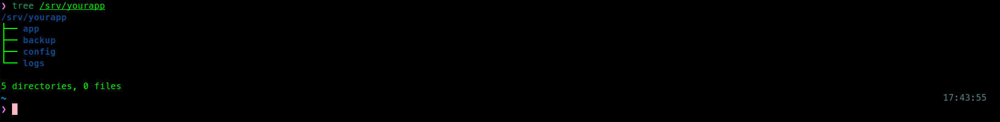
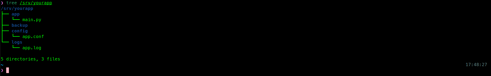
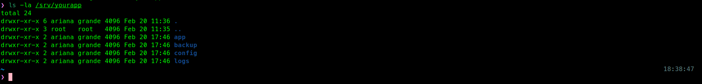
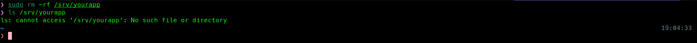

# Setup Web Project Structure

## Objective
Create and organize a structured directory hierarchy for
web application following the Linux Filesystem Hierarchy
Standard (FHS).

## Scenario
This lab simulates preparing the directory structure for deploying 
a web application named Yourapp. The application is stored 
under /srv/, in accordance with Linux Filesystem Hierarchy standards.

### Step 1. Create The Directory Structure
A well-structured directory layout separates application 
components such as code, configuration files, logs, and 
backups making the system easier to manage, troubleshoot, 
and maintain over time.

#### Command
```zsh
sudo mkdir -p <BASE_DIR>/<APP_NAME>/<SUBDIRECTORY>
```
#### Practice
```zsh
sudo mkdir -p /srv/yourapp/app
sudo mkdir -p /srv/yourapp/config
sudo mkdir -p /srv/yourapp/logs
sudo mkdir -p /srv/yourapp/backup
```
#### Verify
```zsh
tree /srv/yourapp
```
#### Expected Output
```
/srv/myapp
├── app
├── backup
├── config
└── logs
```
#### Result



### Step 2. Create Sample Files
Placing placeholder files in each directory confirms the structure is correctly set up
and simulates a real deployment where each directory has a specific purpose.

#### Command
```zsh
sudo touch <BASE_DIR>/<APP_NAME>/<SUBDIRECTORY>/<FILENAME>
```
#### Practice
```zsh
sudo touch /srv/yourapp/app/main.py
sudo touch /srv/yourapp/config/app.conf
sudo touch /srv/yourapp/logs/app.log
sudo touch /srv/yourapp/backup/.gitkeep
```
#### Verify
```zsh
tree /srv/myapp
```
#### Expected Output
```
/srv/myapp
├── app
│   └── main.py
├── backup
│   └── .gitkeep
├── config
│   └── app.conf
└── logs
    └── app.log
```
#### Result



### Step 3. Set Directory Ownership
Using sudo makes root the default owner of new files. In production systems, 
applications should run under a dedicated service account to maintain least privilege.

#### Command
```zsh
sudo chown -R <USER>:<GROUP> <BASE_DIR>/<APP_NAME>
```

#### Practice
```zsh
sudo chown -R ariana:grande /srv/yourapp 
```
#### Verify
```zsh
ls -la /srv/yourapp
```
#### Expected Output
```
drwxr-xr-x ariana grande app
drwxr-xr-x ariana garnde backup
drwxr-xr-x ariana grande config
drwxr-xr-x ariana grande logs
```
#### Result



### Step 4. Set Directory Permissions
Each directory requires a specific permission level. The `logs/` and `backup/`
directories need write access, while `config/` should remain read-only to avoid unintended changes.
#### Command
```zsh
sudo chmod <OCTAL_PERMISSION> <DIRECTORY>
```
#### Practice
```zsh
sudo chmod 755 /srv/yourapp/app
sudo chmod 755 /srv/yourapp/config
sudo chmod 775 /srv/yourapp/logs
sudo chmod 775 /srv/yourapp/backup
```
#### Verify
```zsh
ls -la /srv/yourapp
```
#### Expected Output
```
drwxrwxr-x ariana grande app
drwxrwxr-x ariana garnde backup
drwxrwxr-x ariana grande config
drwxrwxr-x ariana grande logs
```
#### Result


### Step 5. Cleanup

#### Command
```zsh
sudo rm -rf <BASE_DIR>/<APP_NAME>
```
#### Practice
```zsh
sudo rm -rf /srv/yourapp
```
#### Verify
```zsh
ls /srv/
```
#### Result



