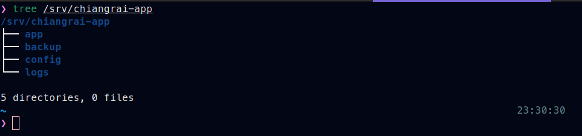
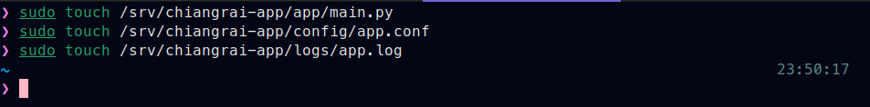
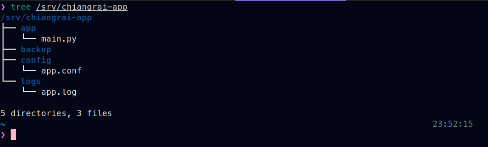
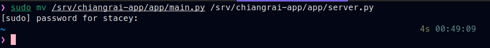
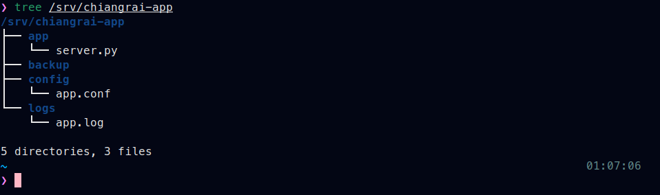
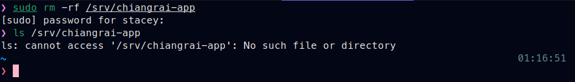

# Create & Organize Project Directory

## Objective
Practice of creating and organizing project directories 
through structured hands-on exercises.

## Section Structure
Each section follows this workflow:
1. Goal 
2. Execute task
3. Verification
4. Notes

## Hands-on Practice - Create & Organize Project Directory

#### Scenario
This lab simulates preparing the directory structure for deploying 
a web application named chiangrai-app. The application is stored 
under /srv/, in accordance with Linux Filesystem Hierarchy standards.

#### Step 1. Create Directory Structure
Prepare the /srv/ directory structure for a web application.
**Command**:
```zsh
sudo mkdir -P <DIRECTORY><NEW_FOLDER>
```
**Practice**:
```zsh
sudo mkdir -p /srv/chiangrai-app/app
sudo mkdir -p /srv/chiangrai-app/config
sudo mkdir -p /srv/chiangrai-app/logs
sudo mkdir -p /srv/chiangrai-app/backup
```


**Verify**

```zsh
tree /srv/chiangrai-app
```


#### Step 2. Create Sample Files
Create a sample file for the Chiangrai web application
**Command**:
```zsh
sudo touch <DIRECTORY><FILE>
```zsh
sudo touch /srv/chiangrai-app/app/main.py
sudo touch /srv/chiangrai-app/config/app.conf
sudo touch /srv/chiangrai-app/logs/app.log
```


**Verify**
```zsh
tree /srv/chiangrai-app
```


#### Step 3. Move & Rename File
Move or rename a file
**Command**:
```zsh
sudo mv <PATH_DIR><FILE> <PATH_DIR><NEW_FILE_NAME>
```
**Practice**:
```zsh
sudo mv /srv/chiangrai-app/app/main.py /srv/chiangrai-app/app/server.py
```


#### Step 4. Verify Directory Tree
Verify the file directory with the directory tree 
**Command**:
```zsh
tree <DIRECTORY>
```
**Practice**:
```zsh
tree /srv/chiangrai-app
```


#### Step 5. Cleanup Directory Structure
Delete directory files
**Comand**
Recursive:
```zsh
sudo rm -rf <DIRECTORY_FILE>
```
Interactive:
```zsh
sudo rm -r -i <DIRECTORY_FILE>
```
**Practice**:
```zsh
sudo rm -rf /srv/chiangrai-app
```

