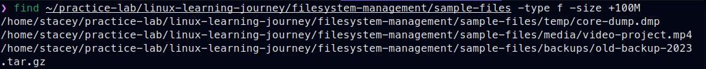
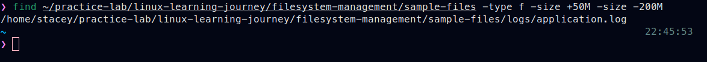

# Search and Analyze Files

## Objective
Practice searching and analyzing files
through structured hands-on exercises.

## Section Structure
Each section follows this workflow:
1. Goal
2. Execute task
3. Verification
4. Notes

### Practice - Scenario Setup
**Create working directory**
```zsh
sudo mkdir -p <DIRECTORY_PATH>/{logs,backups,media,temp}
```

**Create dummy large files**
```zsh
sudo dd if=/dev/zero of=<OUTPUT_FILE> bs=<BLOCK_SIZE> count=<COUNT>
```


### Step 1. Find Files by Size Criteria

#### Find all files larger than 100MB
**Command**
```zsh
find <PATH> -type f -size +<SIZE>
```
**Practice**
```zsh
find ~/practice-lab/linux-learning-journey/filesystem-management/sample-files -type f -size +100M
```


#### Search for files between 50MB and 200M
**Command**
```zsh
find <PATH> -type f -size +<MIN_SIZE> -size -<MAX_SIZE>
```
**Practice**
```zsh
find ~/practice-lab/linux-learning-journey/filesystem-management/sample-files -type f -size +50M -size -200M
```


```zsh
find ~/practice-lab/linux-learning-journey/filesystem-management/sample-files -type f -size +>
```
- Search for files larger than 500MB with detailed information
```zsh
find ~/practice-lab/linux-learning-journey/filesystem-management/sample-files -type f -size 5>
```
- Find .log files larger than 50MB
```zsh
find ~/linux-journey/01-filesystem-management/large-files-analysis -type f -name "*.log" -siz>
```
